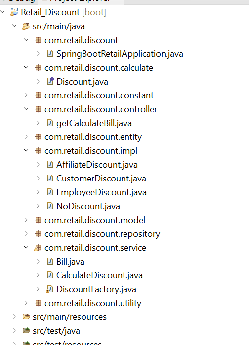
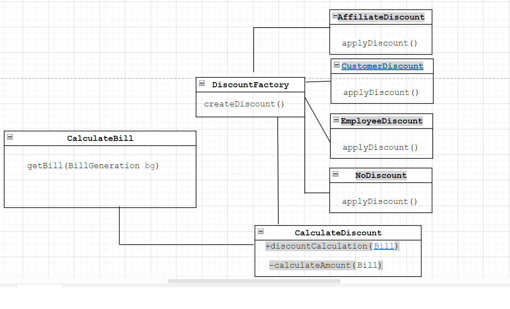

#Overview
The Discount Calculation Program applies the appropriate discount and then calculates the total bill amount. 
A predetermined set of guidelines can be used to determine the discount for different items. It makes it easier for companies and clients to ascertain the final cost when reductions are applied.

# Technologies

1) Java 17

2) Spring boot 3.1.0

#How to install and setup

Method 1: Using Maven
mvn spring-boot:run

Method 2:Run from an IDE
a. Open the project in your preferred IDE (e.g., IntelliJ, Eclipse).

b. Locate the main class SpringBootRetailApplication.java with the @SpringBootApplication annotation.

c. Right-click the class and select Run or Debug to start the application.

To Test the programme 
Step

1. Open postman and put enter url http://localhost:8080/api/generatebill with get method selected in the drop down
2. In the body of the request enter the request in below format
ex
{"billNumber":"123", "userID":"104","items":[{
        "itemName" : "Mobile",
		"price"	: "500"
    },
    {
        "itemName" : "Soap",
		"price"	: "490"
    }]
    }
3. Press send
4. will get the response as below

{
    "billNumber": 123,
    "payableAmount": 945.0,
    "totalAmount": 0.0,
    "discountItemAmount": 0.0,
    "nonDiscountItemAmount": 0.0,
    "user": {
        "id": 104,
        "userName": "shayam",
        "userType": "customer",
        "registrationDate": "20241212"
    },
    "items": [
        {
            "itemName": "Mobile",
            "price": 500.0,
            "itemType": "electronics",
            "discountedPrice": 500.0
        },
        {
            "itemName": "Soap",
            "price": 490.0,
            "itemType": "grocery",
            "discountedPrice": 490.0
        }
    ]
}

where the payableAmount show the amount calculate after the discount

# key feature of Discount Calculator

Purpose of this application is to find the net payable amount on a given bill by validating the items and user on several conditions.

1) If the user is an employee of the store, he gets a 30% discount 

2) If the user is an affiliate of the store, he gets a 10% discount 

3) If the user has been a customer for over 2 years, he gets a 5% discount. 

4) For every $100 on the bill, there would be a $ 5 discount (e.g. for $ 990, you get $ 45 as a discount). 

5) The percentage based discounts do not apply on groceries. 

6) A user can get only one of the percentage based discounts on a bill. 

## Project Structure

### CalculateBill.java

When a new request is received, this controller class is called, and it does the following actions: 

a. It initialized  the user and item lists with some preloaded values.

b. The user type, which is required for the discount computation, will be found from the user ID.

c. The item name will be used to determine the item type; if the item type is grocery, the discount will not apply. 

d. The discount will be calculated by calling the discountCalculation method.

e. after completion returns the response

## CalculateDiscount.java
This class help in determining the discount type object based on the customer type and returns the bill object once the payable amount  has been determined.
To determine the kind of discount that is appropriate for the user, it invokes the createDiscount method.

## DiscountFactory.java
This factory class is used to retrieve the class object that will be utilized to calculate our discount, if user type is employee then EmployeeDiscount class object is returned.

## AffiliateDiscount.java,CustomerDiscount.java,EmployeeDiscount.java,NoDiscount.java
These classes include the logic to compute the discount because different user categories are connected with different discounts. 

##